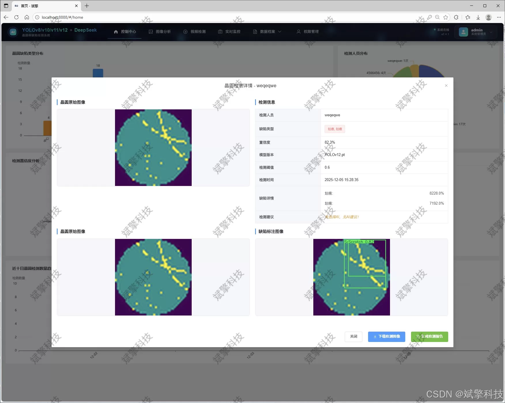
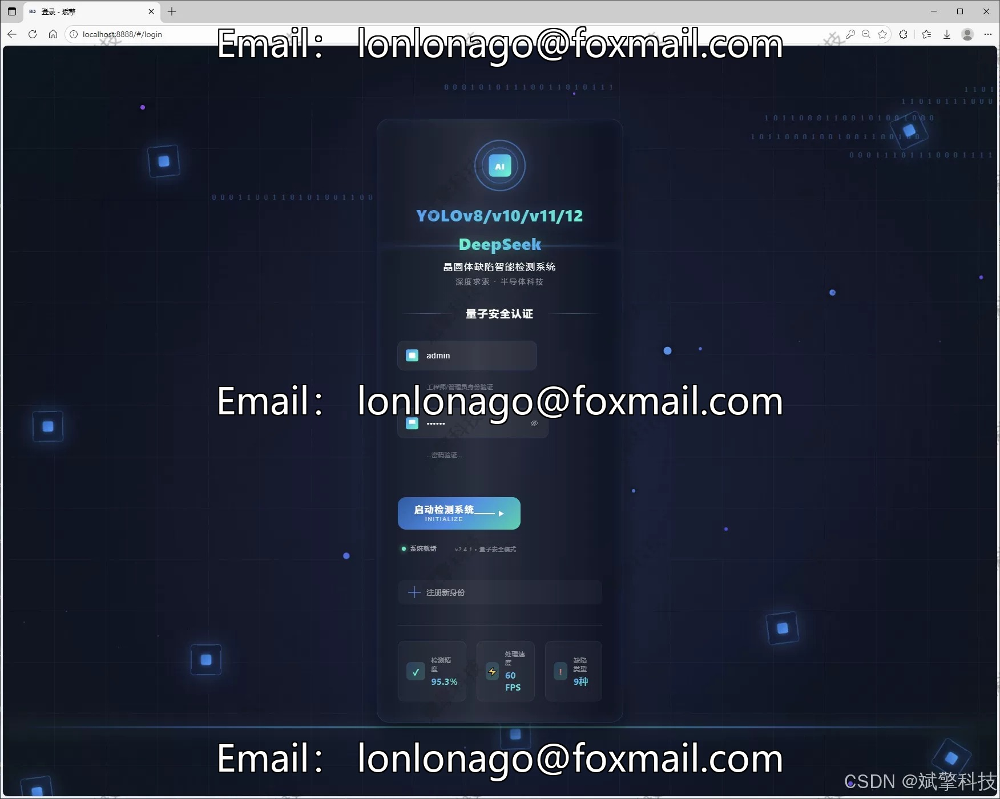
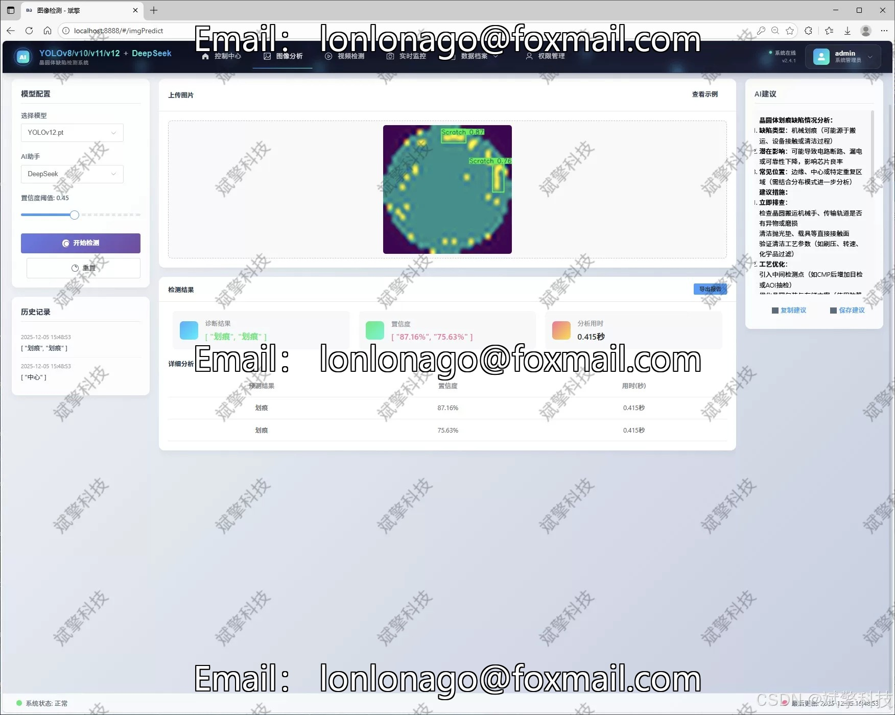
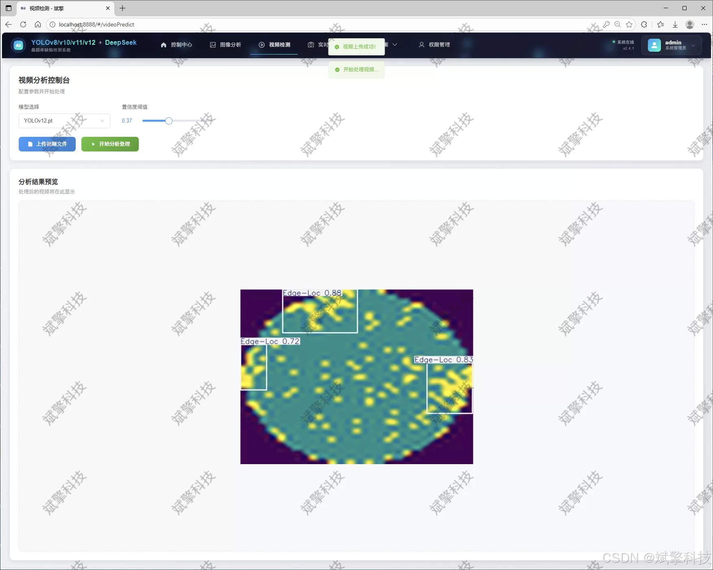
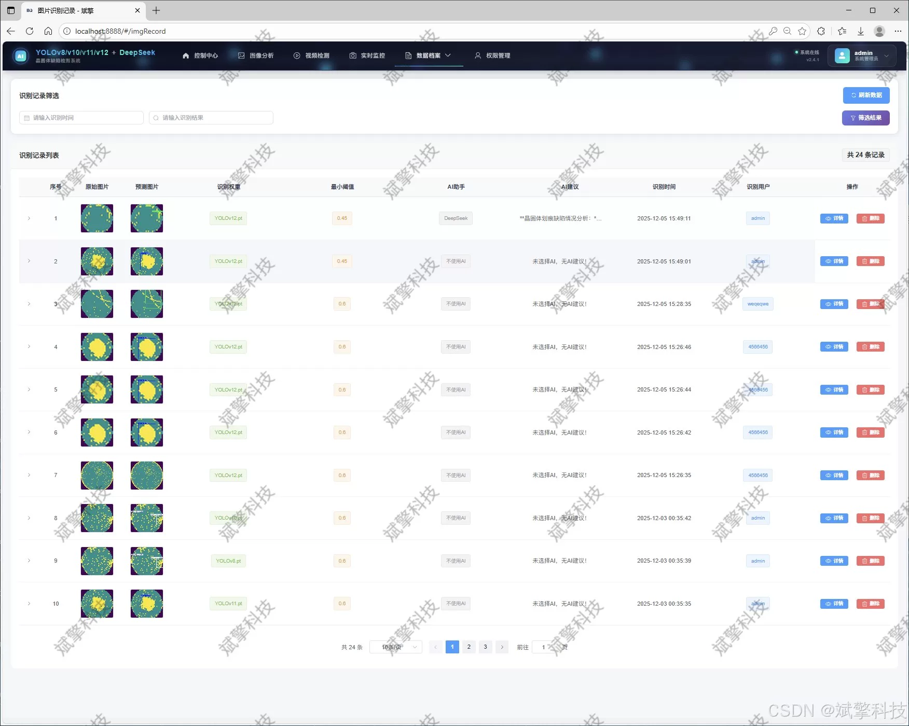
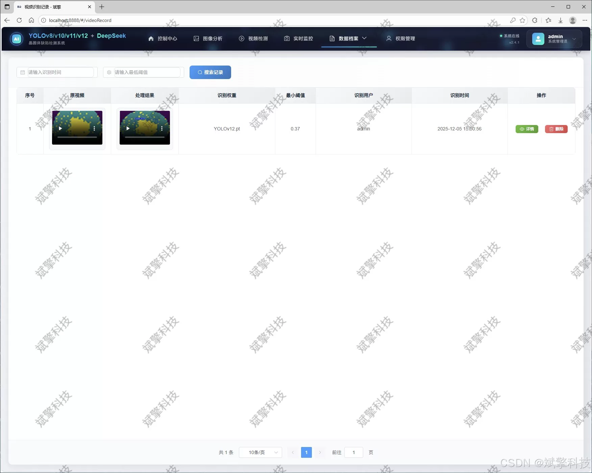
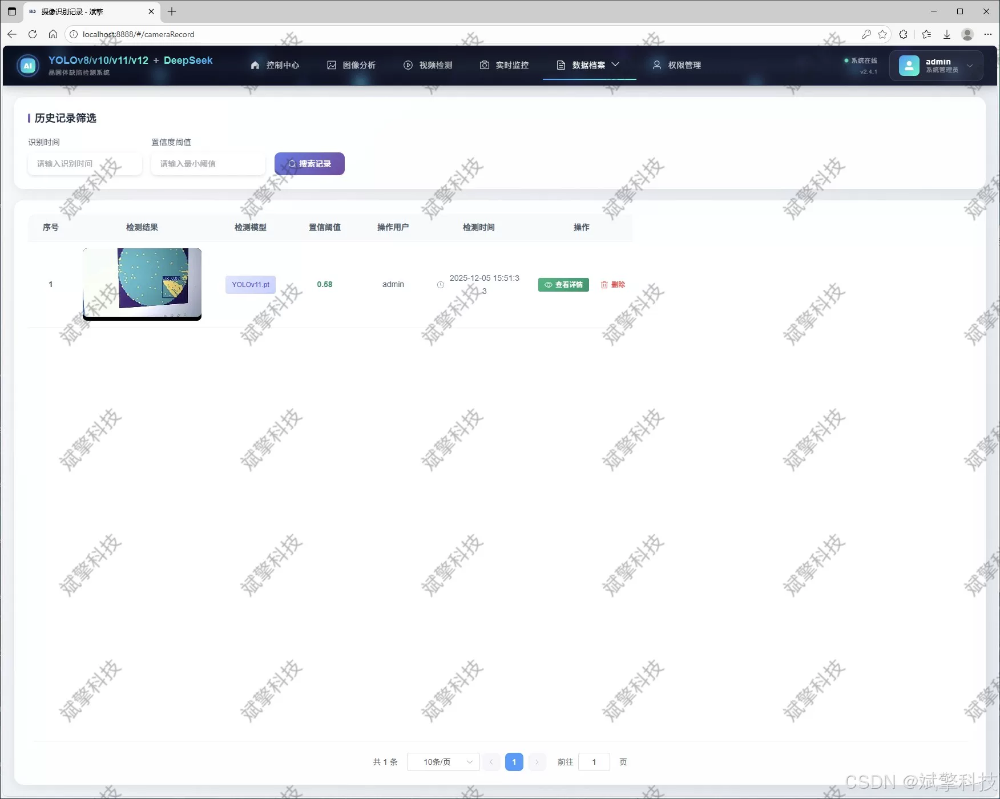
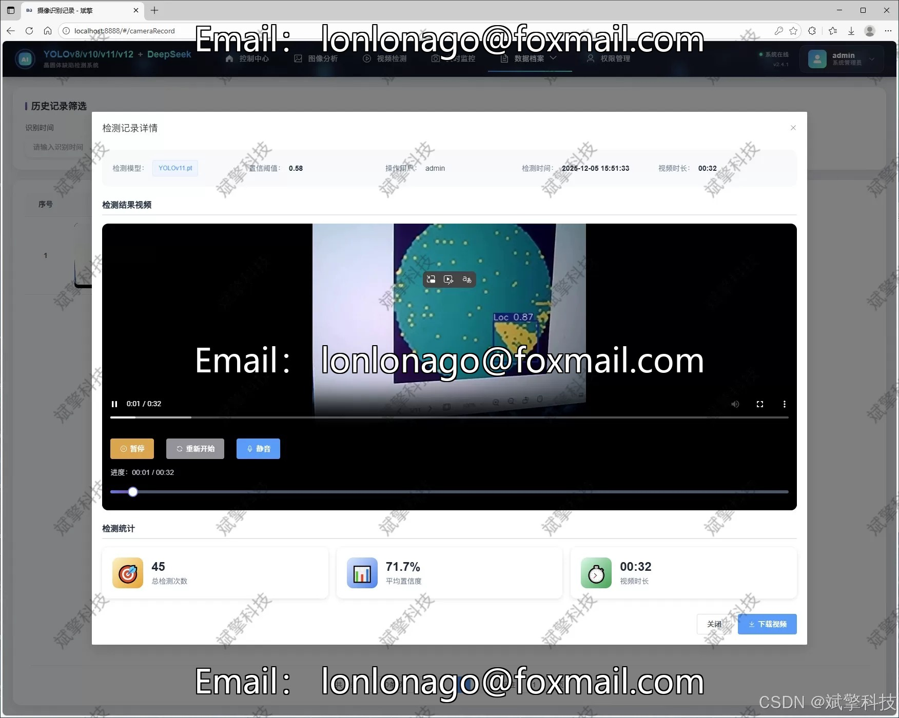
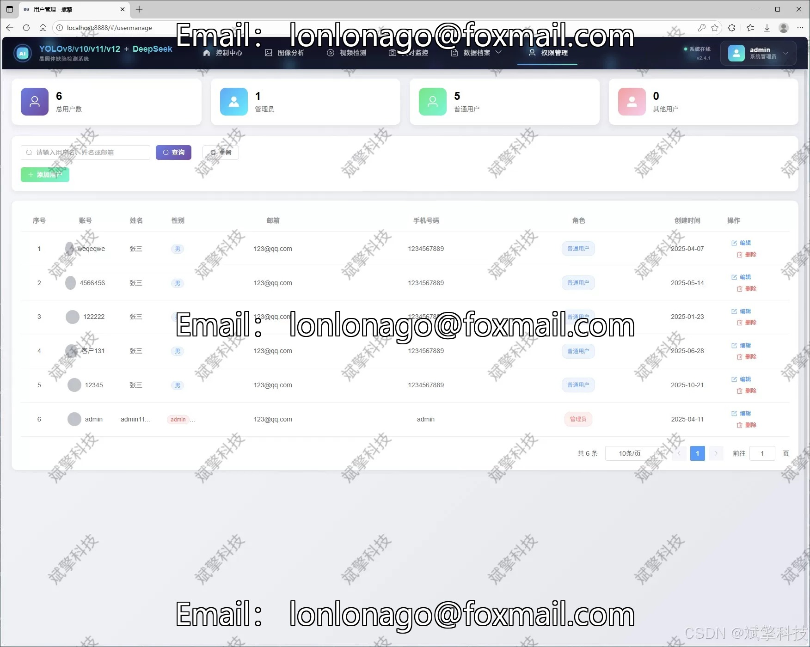

# YOLO+DeepSeek wafer defect detection system

## Body

YOLO+DeepSeek wafer defect detection system is based on YOLO deep learning and big models of Qianwen and DeepSeek, such as wafer body defect recognition detection system (DeepSeek intelligent analysis + web interaction interface + front-end separation + YOLO data + YOLOv8/YOLOv10/YOLOv11/YOLOv12).

This paper proposes a wafer defect detection system based on deep learning technology. The system integrates the most advanced YOLO series object detection algorithms (including YOLOv8, YOLOv10, YOLOv11, and YOLOv12), innovatively incorporating the DeepSeek intelligent analysis module. The system adopts a modern Web architecture with a front-end and back-end separation, equipped with comprehensive user management, multimodal detection (images, videos, real-time cameras), data visualization, and intelligent analysis functions. Through optimized deep learning models and meticulously designed user interfaces, this system can accurately identify nine types of wafer defects, including central defects, ring defects, edge positioning defects, etc., demonstrating significant practical value in the field of semiconductor manufacturing quality control. Experimental results show that the system achieves excellent detection accuracy and real-time performance on a dataset containing 13,000 wafer images, providing an efficient and reliable solution for automated defect detection in the semiconductor manufacturing industry.

Functional module

✅ Information Visualization, Data Visualization.

✅ Image detection supports AI analysis functions, deepseek and Qianwen.

✅ Supports image detection, video detection, and real-time camera detection. The results are saved to a MySQL database.

✅ Picture recognition record management, video recognition record management and camera recognition record management.

✅ User Management Module, administrators can add, delete, modify, and query users.

✅ Personal center, can modify their own information, password name profile picture and so on.

There is no Lunwen writing service, nor any Lunwen.

## Images

## Payment

Here is a pay link on Stripe ( https://buy.stripe.com/3cs8yP7sY87d0vu9AB ). Please contact me lonlonago@foxmail.com after funding $89, and I will send you a complete data files , thank you!

